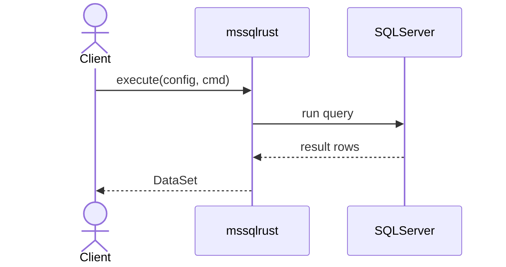
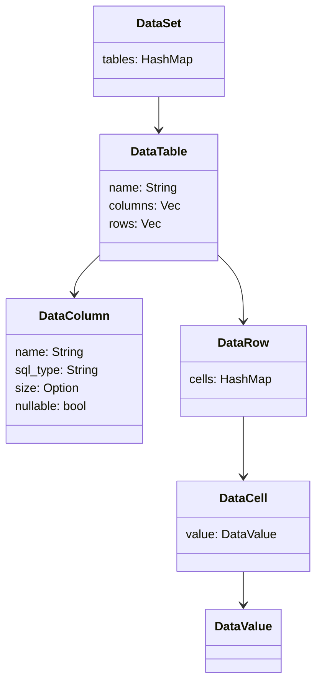

# mssqlrust

mssqlrust is a lightweight Rust library for Microsoft SQL Server built on top of [Tiberius](https://github.com/prisma/tiberius). It executes queries, stored procedures and views and returns results in a typed hierarchy `DataSet → DataTable → DataRow → DataValue` with column metadata, nullable handling and streaming support.

## Installation

Add the dependency to your `Cargo.toml`:

```toml
[dependencies]
mssqlrust = "1.0.2"
```

## How it works

The crate wraps the SQL Server connection using Tiberius and exposes an async `execute` function that receives a [`MssqlConfig`](src/infrastructure/mssql/config.rs) and a [`Command`](src/repositories/command.rs). The returned data is built into the hierarchy `DataSet → DataTable → DataRow → DataValue` for typed access to results.




## Usage
### Basic Query
Run a simple text query and read the first row/column. Results are accessed via `DataSet → DataTable → DataRow`, and you can compare values directly with native Rust types.

```rust
use mssqlrust::{execute, Command};
use mssqlrust::infrastructure::mssql::MssqlConfig;

#[tokio::main]
async fn main() -> anyhow::Result<()> {
    let config = MssqlConfig::new(
        "localhost", 1433, "sa", "YourStrong!Passw0rd", "master", true,
    );

    let cmd = Command::query("SELECT 1 AS value");
    let ds = execute(config, cmd).await?;
    let row = &ds.tables["table0"][0];
    assert_eq!(row["value"], 1);
    println!("value: {:?}", row["value"]);

    Ok(())
}
```

### Parameterized query

```rust
use mssqlrust::{execute, Command, Parameter};
use mssqlrust::infrastructure::mssql::MssqlConfig;
use chrono::NaiveDate;
use rust_decimal::Decimal;

#[tokio::main]
async fn main() -> anyhow::Result<()> {
    let config = MssqlConfig::new(
        "localhost", 1433, "sa", "YourStrong!Passw0rd", "master", true,
    );

    let cmd = Command::query("SELECT @id AS id, @flag AS flag, @amount AS amount, @when AS when_date")
        .with_param(Parameter::new("id", 7))
        .with_param(Parameter::new("flag", false))
        .with_param(Parameter::new("amount", Decimal::new(1999, 2)))
        .with_param(Parameter::new("when", NaiveDate::from_ymd_opt(2024, 6, 1).unwrap()));

    let ds = execute(config, cmd).await?;
    let row = &ds.tables["table0"][0];
    println!("id: {:?}, flag: {:?}, amount: {:?}, when: {:?}", row["id"], row["flag"], row["amount"], row["when_date"]);

    Ok(())
}
```

### Non-Query (rows affected)

Execute commands that don't return result sets (INSERT/UPDATE/DELETE/DDL) and get how many rows were affected.

```rust
use mssqlrust::{execute_non_query, Command, Parameter};
use mssqlrust::infrastructure::mssql::MssqlConfig;

#[tokio::main]
async fn main() -> anyhow::Result<()> {
    let config = MssqlConfig::new(
        "localhost", 1433, "sa", "YourStrong!Passw0rd", "master", true,
    );

    // Text command
    let cmd = Command::query("UPDATE Users SET Active = 0 WHERE LastLogin < @cutoff")
        .with_param(Parameter::new("cutoff", "2024-01-01"));
    let affected = execute_non_query(config.clone(), cmd).await?;
    println!("Updated rows: {}", affected);

    // Stored procedure
    let sp = Command::stored_procedure("sp_archive_users")
        .with_param(Parameter::new("days", 30));
    let archived = execute_non_query(config, sp).await?;
    println!("Archived rows: {}", archived);

    Ok(())
}
```

### Stored Procedure With Parameters

You can execute stored procedures and pass named parameters (with or without the `@` prefix). Parameters accept native Rust types and are converted internally.

```rust
use mssqlrust::{execute, Command, Parameter};
use mssqlrust::infrastructure::mssql::MssqlConfig;
use chrono::NaiveDate;
use rust_decimal::Decimal;

#[tokio::main]
async fn main() -> anyhow::Result<()> {
    let config = MssqlConfig::new(
        "localhost", 1433, "sa", "YourStrong!Passw0rd", "master", true,
    );

    // EXEC sp_upsert_order @id = @P1, @status = @P2, @amount = @P3, @when = @P4
    let cmd = Command::stored_procedure("sp_upsert_order")
        .with_param(Parameter::new("id", 1001))
        .with_param(Parameter::new("status", "PAID"))
        .with_param(Parameter::new("amount", Decimal::new(1299, 2)))
        .with_param(Parameter::new("@when", NaiveDate::from_ymd_opt(2024, 6, 1).unwrap()));

    let ds = execute(config, cmd).await?;

    // If the procedure returns rows, access them normally
    if let Some(table) = ds.tables.get("table0") {
        if !table.rows.is_empty() {
            let row = &table.rows[0];
            println!("order_id: {} status: {}", row["id"].clone(), row["status"].clone());
        }
    }

    Ok(())
}
```

### Scalar (single value)

Return the first column of the first row from either a text query or a stored procedure.

```rust
use mssqlrust::{execute_scalar, Command, Parameter};
use mssqlrust::infrastructure::mssql::MssqlConfig;

#[tokio::main]
async fn main() -> anyhow::Result<()> {
    let config = MssqlConfig::new(
        "localhost", 1433, "sa", "YourStrong!Passw0rd", "master", true,
    );

    // Query scalar
    let v = execute_scalar(config.clone(), Command::query("SELECT 42")).await?;
    assert_eq!(v.unwrap(), 42);

    // Stored procedure scalar
    // CREATE PROCEDURE dbo.sp_add1 @x INT AS BEGIN SELECT @x + 1; END
    let v = execute_scalar(
        config,
        Command::stored_procedure("dbo.sp_add1").with_param(Parameter::new("x", 5)),
    )
    .await?;
    assert_eq!(v.unwrap(), 6);

    Ok(())
}
```

## DataSet structure



## Examples

The [`tests`](tests) directory contains additional examples that show parameterized queries, stored procedures and mapping of various SQL types.

## License

This project is distributed under the terms of the MIT license.
