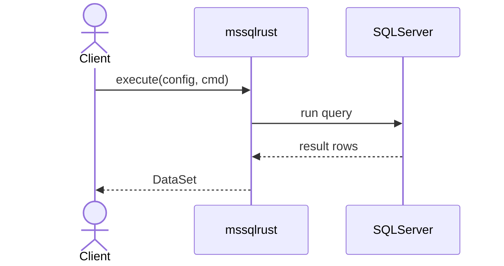
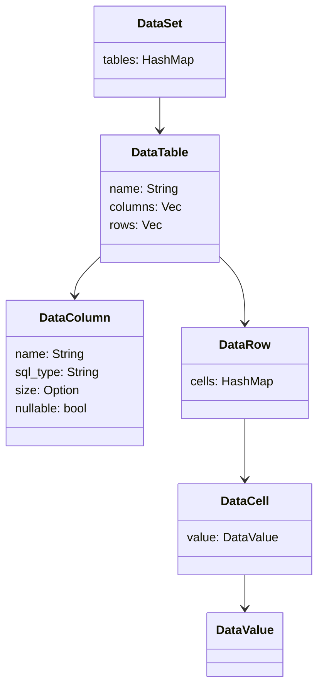

# mssqlrust

mssqlrust is a lightweight Rust library for Microsoft SQL Server built on top of [Tiberius](https://github.com/prisma/tiberius). It executes queries, stored procedures and views and returns results in a typed hierarchy `DataSet → DataTable → DataRow → DataValue` with column metadata, nullable handling and streaming support.

## Installation

Add the dependency to your `Cargo.toml`:

```toml
[dependencies]
mssqlrust = "1.0.0"
```

Adjust the URL or version depending on the source you use.

## How it works

The crate wraps the SQL Server connection using Tiberius and exposes an async `execute` function that receives a [`MssqlConfig`](src/infrastructure/mssql/config.rs) and a [`Command`](src/repositories/command.rs). The returned data is built into the hierarchy `DataSet → DataTable → DataRow → DataValue` for typed access to results.




## Usage
### Basic query
Run a simple text query and read the first row/column. Results are accessed via `DataSet → DataTable → DataRow`, and you can compare values directly with native Rust types.

```rust
use mssqlrust::{execute, Command, Parameter};
use mssqlrust::infrastructure::mssql::MssqlConfig;
use chrono::NaiveDate;
use rust_decimal::Decimal;

#[tokio::main]
async fn main() -> anyhow::Result<()> {
    // Connection configuration
    let config = MssqlConfig::new(
        "localhost",
        1433,
        "sa",
        "YourStrong!Passw0rd",
        "master",
        true,
    );

    // Query returning different SQL types
    let cmd = Command::query(
        "SELECT \
         CAST(42 AS INT)            AS id, \
         N'hello'                   AS name, \
         CAST(1 AS BIT)             AS active, \
         CAST('2024-01-01' AS DATE) AS start_date, \
         CAST(123.45 AS DECIMAL(5,2)) AS price"
    );
    let ds = execute(config.clone(), cmd).await?;
    let row = &ds.tables["table0"][0];

    println!("id: {:?}", row["id"]);
    println!("name: {:?}", row["name"]);
    println!("active: {:?}", row["active"]);
    println!("start_date: {:?}", row["start_date"]);
    println!("price: {:?}", row["price"]);
```

### Parameterized query

```rust
    let cmd = Command::query("SELECT @id AS id, @flag AS flag, @amount AS amount, @when AS when_date")
        .with_param(Parameter::new("id", 7))
        .with_param(Parameter::new("flag", false))
        .with_param(Parameter::new("amount", Decimal::new(1999, 2)))
        .with_param(Parameter::new("when", NaiveDate::from_ymd_opt(2024, 6, 1).unwrap()));
    
    let ds = execute(config.clone(), cmd).await?;
    let row = &ds.tables["table0"][0];

    println!("id: {:?}, flag: {:?}, amount: {:?}, when: {:?}", row["id"], row["flag"], row["amount"], row["when_date"]);

    Ok(())
}
```

### Stored Procedure With Parameters

You can execute stored procedures and pass named parameters (with or without the `@` prefix). Parameters accept native Rust types and are converted internally.

```rust
use mssqlrust::{execute, Command, Parameter};
use mssqlrust::infrastructure::mssql::MssqlConfig;
use chrono::NaiveDate;
use rust_decimal::Decimal;

#[tokio::main]
async fn main() -> anyhow::Result<()> {
    let config = MssqlConfig::new(
        "localhost", 1433, "sa", "YourStrong!Passw0rd", "master", true,
    );

    // EXEC sp_upsert_order @id = @P1, @status = @P2, @amount = @P3, @when = @P4
    let cmd = Command::stored_procedure("sp_upsert_order")
        .with_param(Parameter::new("id", 1001))
        .with_param(Parameter::new("status", "PAID"))
        .with_param(Parameter::new("amount", Decimal::new(1299, 2)))
        .with_param(Parameter::new("@when", NaiveDate::from_ymd_opt(2024, 6, 1).unwrap()));

    let ds = execute(config, cmd).await?;

    // If the procedure returns rows, access them normally
    if let Some(table) = ds.tables.get("table0") {
        if !table.rows.is_empty() {
            let row = &table.rows[0];
            println!("order_id: {} status: {}", row["id"].clone(), row["status"].clone());
        }
    }

    Ok(())
}
```

## DataSet structure



## Examples

The [`tests`](tests) directory contains additional examples that show parameterized queries, stored procedures and mapping of various SQL types.

## License

This project is distributed under the terms of the MIT license.
